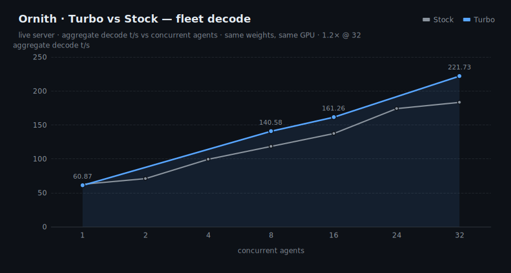
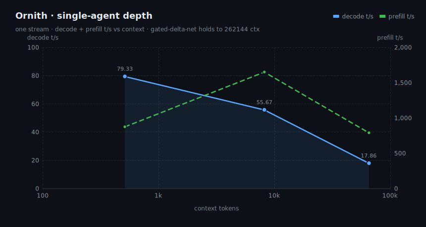

# Ornith-1.0-35B · B70 Turbo &nbsp;·&nbsp; R&D

> **⚗️ R&D snapshot — not a final release.** Benchmarks are measured and reproducible; the polished
> model card, weight upload, and Ornith-aliased accuracy re-run are still pending. Numbers are honest
> but subject to change. Cover art / banner: TODO (drop-in above this line).

B70-tuned serving package for **Ornith-1.0-35B** (`qwen3_5_moe`, 34.7B total / ~3B active), quantized
**Q5_K_M**, running on a single **Intel Arc Pro B70** (30.3 GiB, 230 W) via llama.cpp SYCL. Same weights
as the base model — the "Turbo" is the serving stack (fused decode build + tuned batch/KV/DNN flags), so
every speedup is **lossless**.

## TL;DR

| axis | result |
|---|---|
| **Fleet decode vs stock** | **~1.2× @ 32 agents** (183→222 t/s aggregate) |
| **Concurrency knee** | **np 32** (157.9 t/s agg); np 56 thrashes (timeout) |
| **Single-agent decode** | 79 → 56 → 18 t/s at 0.5k → 8k → 65k ctx |
| **Context** | holds to **262144** (gated-delta-net) with f16 KV |
| **Quality** | lossless decode · GSM8K 97 / HellaSwag 82.1 · teamwork games 38–39 /50 |

## Ship config

```bash
# Agent fleet (default) — knee at np 32
GGML_SYCL_DISABLE_DNN=1 ONEAPI_DEVICE_SELECTOR=level_zero:gpu \
llama-server -m ornith-1.0-35b-Q5_K_M.gguf --alias ornith-1.0-35b-turbo \
  -ngl 99 -fa on -ctk f16 -ctv f16 -c 131072 -np 32 -b 8192 -ub 4096 \
  --host 0.0.0.0 --port 8092 --jinja
```

| mode | flags | throughput |
|---|---|---|
| Agent fleet (default) | `-np 32` | 158–222 t/s aggregate |
| Single deep agent | `-np 1 -c 262144` | 79→18 t/s (shallow→65k) |
| **Never** | `-np ≥ 56` | thrash / timeout — do not serve |

> **KV note:** ship **f16** KV. The batched-bench charts below used the driver's `q8_0` KV; on this SYCL
> backend q8_0 flash-attention decodes far slower at depth, and Q5_K_M fits f16 KV at full 262144 ctx.
> Ornith is a simpler route than AgentWorld: **no speculative decode** (ngram didn't win on its prompts).

---

## Benchmarks

### 1 · Concurrency Pareto — how many agents to serve
`llama-batched-bench`, 2048-tok prompt + 256 gen. Aggregate climbs to a **knee at np 32**; np 56
thrashes into a timeout (30 GiB spill).


| agents | 1 | 8 | 16 | 24 | **32** | 40 | 48 | 56 |
|---|--:|--:|--:|--:|--:|--:|--:|--:|
| aggregate t/s | 75.9 | 106.8 | 126.3 | 144.5 | **157.9** | 167.4 | 175.5 | timeout |
| per-agent t/s | 75.9 | 13.3 | 7.9 | 6.0 | **4.9** | 4.2 | 3.7 | — |

### 2 · Turbo vs Stock — fleet decode
Same weights / GPU / compiler, only the serving stack differs. Peaks **1.21× at 32 agents**.



| agents | 1 | 8 | 16 | 32 | structured×32 | novel×32 |
|---|--:|--:|--:|--:|--:|--:|
| stock | 62.5 | 118.3 | 137.3 | 183.2 | 134.5 | 103.0 |
| **turbo** | 60.9 | 140.6 | 161.3 | **221.7** | 165.9 | 133.6 |
| ratio | 0.97× | 1.19× | 1.17× | **1.21×** | 1.23× | 1.30× |

### 3 · Single-agent depth — decode + prefill vs context
One stream, full context. Decode is KV/attention-bound at depth; prefill ramps with `-ub 4096` then
tapers. Gated-delta-net holds to 262144.



| context tok | 512 | 8k | 65k |
|---|--:|--:|--:|
| decode t/s | 79.3 | 55.7 | 17.9 |
| prefill t/s | 873 | 1649 | 789 |

### 4 · Accuracy (Q5_K_M, lm-eval)
Lossless quant + serving → accuracy unchanged. Wikitext-2 **PPL 6.36** (lower better).


| GSM8K | HellaSwag | Winogrande | ARC-Challenge | MMLU | TruthfulQA-MC1 |
|--:|--:|--:|--:|--:|--:|
| 97.0 | 82.1 | 71.6 | 49.2 | 41.1 | 35.7 |

_Source: agentic-arcade base lm-eval set (reference slot); re-run under the Ornith alias for the final card._

### 5 · Teamwork game-quality (source-review /50)
`agentic-arcade` teamwork builds, 2026-06-30 run. Both games shipped **playable/winnable**. (Build quality
is stochastic per run — the 2026-06-29 build scored 33/34.)


| game | score /50 | verdict |
|---|--:|---|
| Frogger | 38 | winnable — goals reachable, river crossable |
| Maze | 39 | playable/winnable — kill-all advances |

---

## Reproduce

```bash
# charts (uses the newjordan/echarts fork via SSR → SVG)
ECHARTS_ESM=/path/to/newjordan-echarts/dist/echarts.esm.min.mjs node charts/gen_charts.mjs
```

Raw data in [`data/`](data/). Serving/bench harnesses live in `qworld_turbo/` (moe-ready build,
`bench/run_live_evals.sh`, `bench/concurrency_pareto_guarded.sh`).

## Provenance / caveats
- Weights: `qwen3_5_moe` Ornith-1.0-35B, Q5_K_M (imatrix). Not in this repo (R&D).
- Charts rendered dark to sit in GitHub's palette; source SVGs are static (no scripts).
- Throughput is architecture-determined — the `qwen3_5_moe` family (AgentWorld/NEX2/SIQ) traces the same
  curve; these models differ only in quality, not raw t/s.
