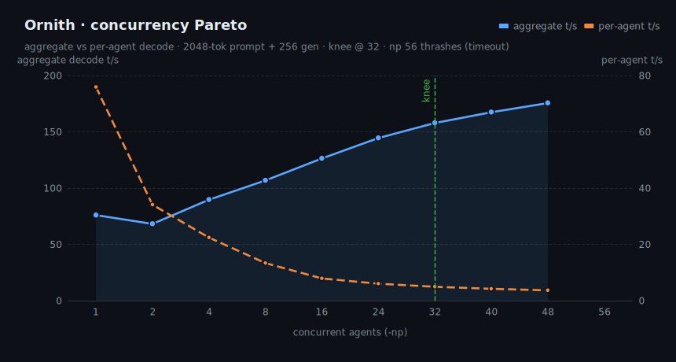
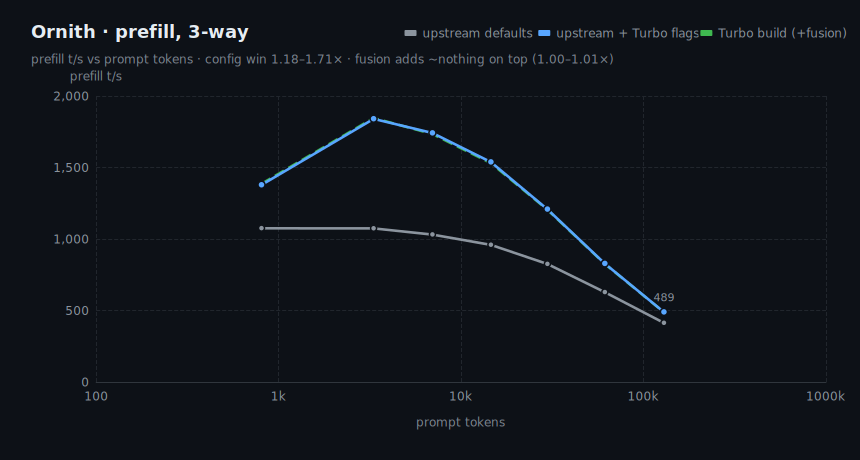
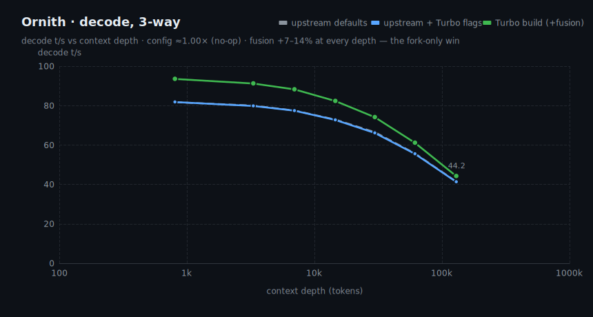
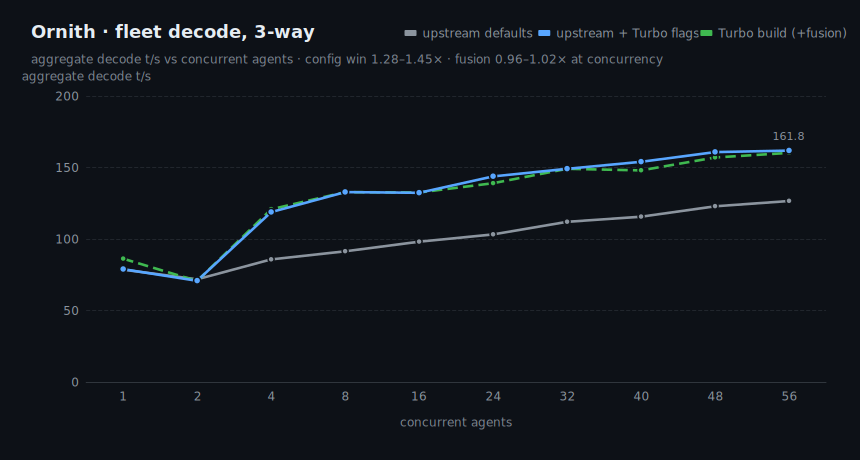
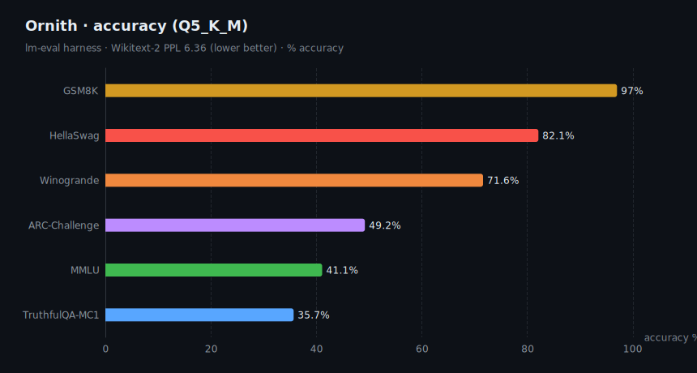
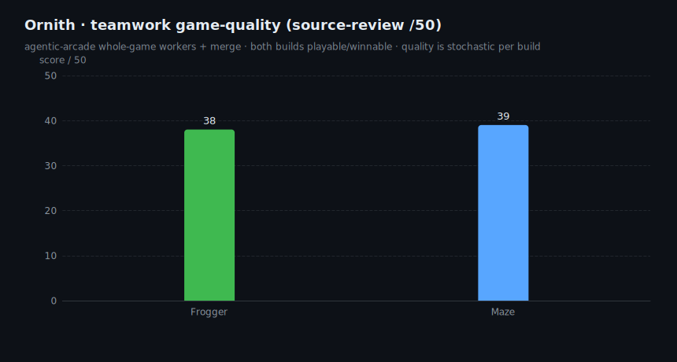

# Ornith-1.0-35B · B70 Turbo &nbsp;·&nbsp; R&D

> **⚗️ R&D snapshot — not a final release.** Benchmarks are measured and reproducible; the polished
> model card, weight upload, and Ornith-aliased accuracy re-run are still pending. Numbers are honest
> but subject to change. Cover art / banner: TODO (drop-in above this line).

B70-tuned serving package for **Ornith-1.0-35B** (`qwen3_5_moe`, 34.7B total / ~3B active), quantized
**Q5_K_M**, running on a single **Intel Arc Pro B70** (30.3 GiB, 230 W) via llama.cpp SYCL. Same weights
as the base model — the "Turbo" is the serving stack (fused decode build + tuned batch/KV/DNN flags), so
every speedup is **lossless**.

## TL;DR

| axis | result |
|---|---|
| **Prefill / fleet win** | **1.2–1.7× / ~1.3–1.45×** — 100% runtime config, reproducible on stock upstream |
| **Single-stream decode win** | **+7–14%** at every depth — the fork-only (fusion) win |
| **Concurrency knee** | **np 32** (157.9 t/s agg, batched-bench); np 56 thrashes there (timeout) |
| **Context** | holds to **262144** (gated-delta-net) with f16 KV |
| **Quality** | lossless decode · GSM8K 97 / HellaSwag 82.1 · teamwork games 38–39 /50 |

## Where the speed comes from

Honest 3-way decomposition, same weights / GPU / compiler throughout:
**(1) upstream** = mainline llama.cpp, default flags · **(2) up+flags** = same mainline + Turbo runtime
flags (`GGML_SYCL_DISABLE_DNN=1 -b 8192 -ub 4096`) · **(3) Turbo** = fork (+3 unmerged fusion commits:
topk-MoE router fusion, gate-glue fusion, single-token expert-aggregate) + same flags.
`config win = (2)/(1)` · `code win = (3)/(2)`.

| win | size | where it comes from |
|---|---|---|
| Prefill | 1.2–1.7× | **100% runtime config** — reproducible on stock upstream; fusion adds ~nothing (1.00–1.01×) |
| Fleet (concurrency) | ~1.3–1.45× | same story — config, not fusion |
| Single-stream decode | **+7–14%** at every depth (0.8k→129k) | **fork-only** — the 3 fusion commits, the one real code win |

Costs:
- At ≥40 concurrent agents the fusion is ~2–4% *slower* than the same flags without it (code win 0.96–0.98×) — batch overhead.
- `-ub 4096` trades VRAM (larger compute buffer) for the prefill win.

Quality: identical weights, lossless.

Provenance: the Q4/Q5/Q6_K MoE reorder is **merged upstream** (`ggml-org/llama.cpp` PR #24452); the 3
fusion commits above are fork-only, no PR.

Full tables + charts: benchmarks §2–4 below.

## Ship config

```bash
# Agent fleet (default) — knee at np 32
GGML_SYCL_DISABLE_DNN=1 ONEAPI_DEVICE_SELECTOR=level_zero:gpu \
llama-server -m ornith-1.0-35b-Q5_K_M.gguf --alias ornith-1.0-35b-turbo \
  -ngl 99 -fa on -ctk f16 -ctv f16 -c 131072 -np 32 -b 8192 -ub 4096 \
  --host 0.0.0.0 --port 8092 --jinja
```

| mode | flags | throughput |
|---|---|---|
| Agent fleet (default) | `-np 32` | 149 t/s aggregate (86–160 t/s across np 1→56, f16 KV, live-server harness) |
| Single deep agent | `-np 1 -c 262144` | 93→44 t/s (805→129k depth, f16 KV) |
| **Avoid** | `-np ≥ 56` (batched-bench harness) | thrash / timeout there — see §1 knee |

> **KV note:** ship **f16** KV. The concurrency-Pareto chart below (§1) used the driver's `q8_0` KV;
> on this SYCL backend q8_0 flash-attention decodes far slower at depth than f16. The 3-way benchmarks
> (§2–4) all measure **f16** KV, matching ship config — Q5_K_M fits it at full 262144 ctx.
> Ornith is a simpler route than AgentWorld: **no speculative decode** (ngram didn't win on its prompts).

---

## Benchmarks

### 1 · Concurrency Pareto — how many agents to serve
`llama-batched-bench`, 2048-tok prompt + 256 gen. Aggregate climbs to a **knee at np 32**; np 56
thrashes into a timeout (30 GiB spill). This harness segfaults on the current fusion build, so §2–4
below switch to `llama-server` + a synthetic client instead.



| agents | 1 | 8 | 16 | 24 | **32** | 40 | 48 | 56 |
|---|--:|--:|--:|--:|--:|--:|--:|--:|
| aggregate t/s | 75.9 | 106.8 | 126.3 | 144.5 | **157.9** | 167.4 | 175.5 | timeout |
| per-agent t/s | 75.9 | 13.3 | 7.9 | 6.0 | **4.9** | 4.2 | 3.7 | — |

### 2 · Prefill, 3-way — where the win comes from
Config (`-b 8192 -ub 4096`, DNN off) does it all; the fork fusion adds ~nothing on top (1.00–1.01×).



| prompt | upstream | up+flags | Turbo | config | code | whole |
|--:|--:|--:|--:|:--:|:--:|:--:|
| 805 | 1075 | 1378 | 1386 | 1.28× | 1.01× | 1.29× |
| 3313 | 1074 | 1840 | 1846 | 1.71× | 1.00× | 1.72× |
| 6963 | 1031 | 1741 | 1734 | 1.69× | 1.00× | 1.68× |
| 14563 | 959 | 1538 | 1531 | 1.60× | 1.00× | 1.60× |
| 29713 | 825 | 1208 | 1205 | 1.46× | 1.00× | 1.46× |
| 61341 | 628 | 828 | 826 | 1.32× | 1.00× | 1.32× |
| 129325 | 413 | 489 | 488 | 1.18× | 1.00× | 1.18× |

### 3 · Decode, 3-way — the one fork-only win
Config is a no-op here (≈1.00×); the fusion adds **+7–14%** at every depth. This is the real
Turbo-only speedup — everything else on this page is available on stock upstream.



| depth | upstream | up+flags | Turbo | config | code | whole |
|--:|--:|--:|--:|:--:|:--:|:--:|
| 805 | 81.7 | 81.8 | 93.5 | 1.00× | 1.14× | 1.14× |
| 3313 | 80.0 | 79.8 | 91.2 | 1.00× | 1.14× | 1.14× |
| 6963 | 77.5 | 77.4 | 88.2 | 1.00× | 1.14× | 1.14× |
| 14563 | 72.9 | 72.7 | 82.3 | 1.00× | 1.13× | 1.13× |
| 29713 | 66.5 | 66.1 | 74.1 | 0.99× | 1.12× | 1.11× |
| 61341 | 55.7 | 55.5 | 61.1 | 1.00× | 1.10× | 1.10× |
| 129325 | 41.4 | 41.3 | 44.2 | 1.00× | 1.07× | 1.07× |

### 4 · Fleet decode, 3-way — config again, fusion turns slightly negative
Config wins 1.28–1.45×; at ≥40 agents the fusion costs 2–4% (code win 0.96–0.98×) — batch overhead.
Measured via `llama-server` + a synthetic 2048+256 client (see §1 note on why).



| agents | upstream | up+flags | Turbo | config | code | whole |
|--:|--:|--:|--:|:--:|:--:|:--:|
| 1 | 78.5 | 78.9 | 86.2 | 1.01× | 1.09× | 1.10× |
| 2 | 71.8 | 70.8 | 70.6 | 0.99× | 1.00× | 0.98× |
| 4 | 85.7 | 118.8 | 120.8 | 1.39× | 1.02× | 1.41× |
| 8 | 91.4 | 132.8 | 132.8 | 1.45× | 1.00× | 1.45× |
| 16 | 98.1 | 132.3 | 132.5 | 1.35× | 1.00× | 1.35× |
| 24 | 103.2 | 143.8 | 139.0 | 1.39× | 0.97× | 1.35× |
| 32 | 112.0 | 149.1 | 149.1 | 1.33× | 1.00× | 1.33× |
| 40 | 115.6 | 154.0 | 148.0 | 1.33× | 0.96× | 1.28× |
| 48 | 122.9 | 160.8 | 157.0 | 1.31× | 0.98× | 1.28× |
| 56 | 126.6 | 161.8 | 160.2 | 1.28× | 0.99× | 1.27× |

### 5 · Accuracy (Q5_K_M, lm-eval)
Lossless quant + serving → accuracy unchanged. Wikitext-2 **PPL 6.36** (lower better).



| GSM8K | HellaSwag | Winogrande | ARC-Challenge | MMLU | TruthfulQA-MC1 |
|--:|--:|--:|--:|--:|--:|
| 97.0 | 82.1 | 71.6 | 49.2 | 41.1 | 35.7 |

_Source: agentic-arcade base lm-eval set (reference slot); re-run under the Ornith alias for the final card._

### 6 · Teamwork game-quality (source-review /50)
`agentic-arcade` teamwork builds, 2026-06-30 run. Both games shipped **playable/winnable**. (Build quality
is stochastic per run — the 2026-06-29 build scored 33/34.) Example builds: [`examples/games/`](examples/games/).



| game | score /50 | verdict |
|---|--:|---|
| Frogger | 38 | winnable — goals reachable, river crossable |
| Maze | 39 | playable/winnable — kill-all advances |

---

## Reproduce

```bash
# charts (uses the newjordan/echarts fork via SSR → SVG)
ECHARTS_ESM=/path/to/newjordan-echarts/dist/echarts.esm.min.mjs node charts/gen_charts.mjs
ECHARTS_ESM=/path/to/newjordan-echarts/dist/echarts.esm.min.mjs node charts/gen_threeway.mjs
```

Raw data in [`data/`](data/); raw bench files behind the 3-way tables (llama-bench `.md` + pareto
`.tsv`, all 3 configs) in [`data/raw/`](data/raw/). Serving/bench harnesses live in `qworld_turbo/`
(moe-ready build, `bench/run_live_evals.sh`, `bench/concurrency_pareto_guarded.sh`).

## Provenance / caveats
- Weights: `qwen3_5_moe` Ornith-1.0-35B, Q5_K_M (imatrix). Not in this repo (R&D).
- Charts rendered dark to sit in GitHub's palette; source SVGs are static (no scripts).
- Throughput is architecture-determined — the `qwen3_5_moe` family (AgentWorld/NEX2/SIQ) traces the same
  curve; these models differ only in quality, not raw t/s.
